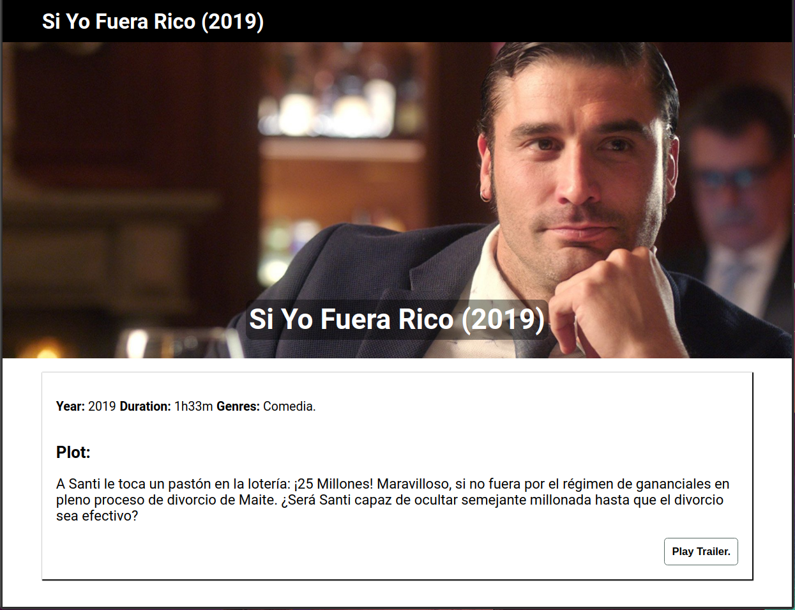

# Movies-test

> A multi-pages website to load different movie lists and check the single movie details and trailer.

## Screenshot

**Homepage**

**Movie details**

**Trailer page**

## Usage

* Clone this repo in your local environment using `git clone`.

* `npm install` to begin dependencies installation.

* `npm start` to run it.

* `npm test` to run the jest tests.

* `npm run test:e2e` to open the cypress tests utility. If you had not run `npm start`, use `npm run test:e2e:start`.

## Improvements/Known bugs/Work in progress

* API calls with cors-anywhere to avoid cors blocks.
* Slider with dynamic width.
* Movie details page with information about the movies.
* Trailer page.
* Testing with jest and cypress. 

## Improvements/Known bugs/Work in progress

* Improvement: The slider is written in pure CSS and it's depending by the width of the Movie container. Todo: link the different files to make use of the CSS media queries to make height responsive (at current status only the width is).
* Improvement: errors management inside the single components.
* Improvement: possible improvement of the generic style to be more similar to the company website.
* Fixing: warning in console when opening movieDetail components *Cannot update a component (`App`) while rendering a different component (`MovieDetails`).* caused by reactContext implementation (trying to setState of App-context from a child component).
* Fixing: `npm test` it's warning us that *An update to Component inside a test was not wrapped in act(...).* for all the components that are updating the state with UseEffect.
* Fixing: need to implement Effects with Cleanup to avoid memory leaks.

## Built with

* [React](https://reactjs.org/) - Front end library for building user interfaces.
* [Webpack](https://webpack.js.org/) - A bundler for javascript and friends.
* [Babel](https://babeljs.io/) - The compiler for next generation JavaScript.
* [Jest](https://jestjs.io/) - Delightful JavaScript Testing.
* [React-testing-library](https://testing-library.com/) - React testing utilities.
* [Cypress](https://www.cypress.io/) - JavaScript End to End Testing Framework.

## Authors

* Pier Andrea Delise: [GitHub](https://github.com/pierandread) - [LinkedIn](https://www.linkedin.com/in/pier-andrea-delise/)
